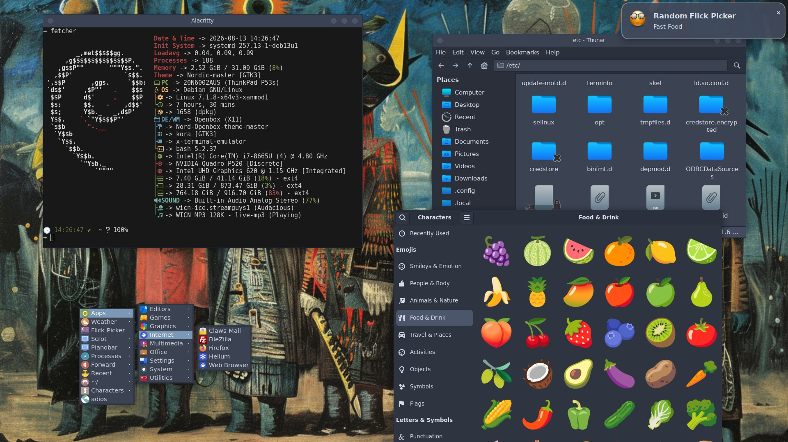
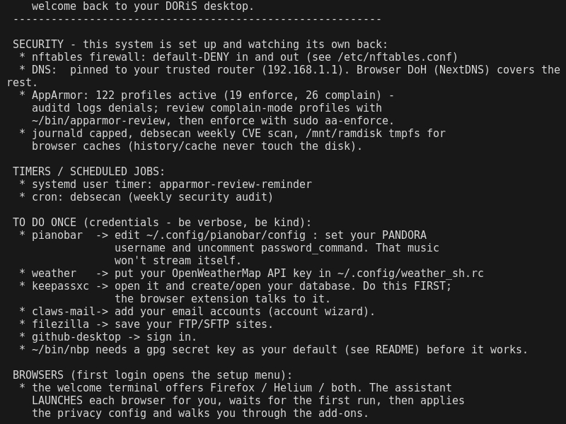
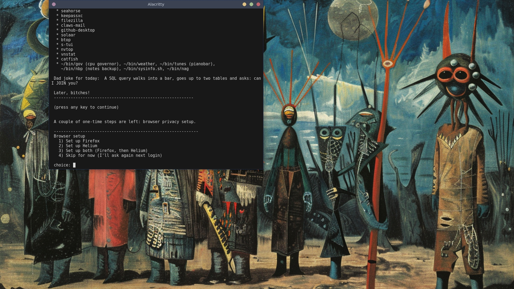

# DORiS — Debian Openbox Restoration Script

One stick. One button. Hardened, configured, wicked desktop. Off-line. Run and done.

DORiS is a desktop restoration system for **any amd64 machine** running Debian
trixie. Run it after a fresh net-install and it recreates the doris desktop —
Openbox/X11, keyboard-driven, hardened — from one kit. Everything the restore
needs is vendored inside this repo, so it works offline: the only network it
needs is `apt`. Two browsers, configured and hardened for you, of course.
Menus, keys, firewall, welcome screen. It's a whole 'nother level, right in
your pocket.


*The doris desktop — Openbox, keyboard-driven...colorful.*


*First-login welcome — generated from the kit itself, so it never rots.*


*The browser assistant — walks you through Firefox + Helium setup with hardened profiles.*

## Why DORiS

DORiS is a disposition: a humanist's way of computing, where the machine bends to how you
think, not the other way around. The hundred hours of "how I like my box"
written down, so a fresh install comes out the other side already home.

Everything you need is at the ready — a keybind or a handy alias or a script
away. All your keys work before you even learn they exist. Everything works
every time, all of the time, the way you actually want it to. Security is built
in. Automagic is built in. Of course it is — this is a power user's machine.
Robust. Reliable. The kind you can be productive on all day.

**Whaddya want for nuthin'?**

## Try it in a VM — 30 minutes

Don't want to touch your daily driver? Restore a disposable QEMU guest and
watch the kit work end to end.

1. Grab the [Debian trixie netinst ISO](https://www.debian.org/distrib/netinst).
2. Create a disk and boot the installer with KVM:

   ```sh
   qemu-img create -f qcow2 doris-test.qcow2 20G
   qemu-system-x86_64 -enable-kvm -m 4096 -cpu host \
     -cdrom debian-trixie-netinst.iso \
     -hda doris-test.qcow2 \
     -netdev user,id=n0 -device e1000,netdev=n0 -boot d
   ```

   No KVM? Swap `-enable-kvm -cpu host` for `-accel tcg` — slower, works anywhere.

3. Net-install as normal: a root password, your user added to sudo, "standard
   system utilities" only. Reboot — this time boot the disk (`-boot c`, no
   `-cdrom`).
4. As your new user:

   ```sh
   sudo apt-get install -y git
   git clone https://github.com/rabmach/DORiS ~/DORiS
   cd ~/DORiS
   sudo ./restore.sh     # system half
   ./user-setup.sh       # per-user half
   ```

5. `startx` and meet your new desktop. QEMU's user-network gateway (`10.0.2.2`)
   counts as a trusted LAN, so the kit picks the router DNS posture
   automatically.

## The docs

* [**00 — The Big Picture**](docs/00-big-picture.md) — quick version first,
  then the architecture exploded: the two halves, the restore flow, task by
  task, the supporting machinery, and the honest limits.
* [**03 — The Decision Journal**](docs/03-decision-journal.md) — every real
  decision in the kit, with the if/then/buts: why Openbox, why bash, why the
  firewall has an all-TCP outbound, why the browser assistant is interactive,
  why the kit split in two.
* [**04 — The Bug Log**](docs/04-bug-log.md) — the bugs that survived to a
  real machine: fresh-install ownership, the invisible task failure, the
  stale key pin. Each with root cause and fix, kept as a teaching record.

## The quick version

1. Net-install Debian trixie. Create a root password and standard system utilities only (Software).
2. As root, prepare your user:

   ```sh
   apt-get update && apt-get install -y git sudo
   adduser <youruser>
   adduser <youruser> sudo
   echo '<youruser> ALL=(ALL) NOPASSWD: ALL' > /etc/sudoers.d/<youruser>
   reboot
   ```

3. Get the kit onto the machine either way:

   **cloned repo:**
   ```sh
   git clone https://github.com/rabmach/DORiS ~/DORiS
   cd ~/DORiS
   ```
   **backup drive:**
   ```sh
   sudo mount /dev/<backupdrive> /mnt
   cd /mnt/DORiS
   ```

   Then run the two halves:

   ```sh
   sudo ./restore.sh          # system half (needs root)
   ./user-setup.sh            # per-user half (bakes $USER/$HOSTNAME into configs)
   ```

4. Reboot. `startx` (or configure auto-login). The first-login welcome
   screen greets you with keybinds, aliases, timers and the one-time
   credential chores, then offers the browser setup menu.

The kit can live anywhere and DORiS doesn't care: `~/DORiS` from a `git
clone`, a mounted backup drive (`/mnt/…`), a USB stick, whatever. You just
run it from wherever it is. (`$DORIS_DIR` is resolved from the script's own
location, never from a hardcoded path.)

Machine-agnostic by design: vendor firmware (Intel/AMD microcode, VA-API
drivers) is auto-detected at install time, and hardware-specific extras are
optional overlays that never touch the core kit.

DORiS splits into two halves:

| half | script | when | does what |
|------|--------|------|-----------|
| **system** | `sudo ./restore.sh` | once per machine | repos, packages, system-wide icons+themes, firewall, DNS strategy, AppArmor, logs, timers |
| **per-user** | `sudo ./user-setup.sh` | once per user | dotfiles, `~/bin`, films.txt, wallpapers, browsah browser assistant, first-login welcome |

Run the system half once, then the per-user half for every user who logs
in on that machine. Both are idempotent and back up before they touch a
file, so a second user — or a re-run — is safe.

## What the system half does

| task | what |
|------|------|
| 00-check | root, amd64, **networking (dies without it)**, Wayland detection (warns, stays X11), kit self-test |
| 01-connection | **auto-detects** trusted-LAN vs direct-ISP and picks the DNS strategy (see Security) |
| 02-repos | apt repos: Mozilla (Firefox), Helium, Sublime Text, GitHub Desktop (shiftkey); key fingerprints verified |
| 03-packages | full core package list (see `packages/core.list`) + stock kernel + vendor microcode (auto-detected) + optional extras |
| 04-assets | **icons + themes → `/usr/share`** so root apps match; icon caches rebuilt; nothing in `~/.local` |
| 05-hardening | nftables, DNS (router pin or encrypted stubby), AppArmor, journald caps, debsecan cron, ramdisk tmpfs, CPU governor, sysctl drop-ins (`hardening/sysctl.d/60-doris-*.conf`) |
| 05-tweaks | loginfetch tty banner (dynamic `/etc/issue` on every tty login), Ctrl+Alt+Backspace kill-X, boot to multi-user + tty1 autostart X |
| 06-verify | confirms the important bits took, writes the install marker |

## What the per-user half does

| task | what |
|------|------|
| 10-config | `config/` → `~/.config`, `bin/` → `~/bin`, `home/` → `~/` (dotfiles + **films.txt**), Thunar scripts, `Pictures/`; `$USER`/`$HOSTNAME` tokens baked in |
| 11-browsers | stages browsah → `~/browsah`, installs the **assistant** `~/bin/browsers-setup` (the welcome menu drives first-login setup) |
| 12-welcome | generates the first-login welcome from the kit (keybinds, aliases, timers, admin apps, credential nags, dad joke), then offers the browser setup menu; arms the AppArmor review timer |

## Applying updates

`git pull` only downloads the new scripts — it changes nothing on your box.
To apply a kit update, re-run the half that owns the changed task:

* system-level changes (`tasks/system/*`, e.g. `update-alternatives`,
  nftables, sysctl, packages) → `sudo ./restore.sh`
* user-level changes (`tasks/user/*`, `config/`, `bin/`, `browsers/`) →
  `./user-setup.sh`

Both halves are idempotent: backups go to `<kit>/backups/` first, already-
done steps are skipped, and nothing is re-downloaded. If in doubt, run the
system half too — it re-verifies what matters (task 06) rather than
wrecking anything.

## Security

Two postures, decided automatically at runtime:

* **Behind a router** (default gateway is RFC1918/link-local/ULA): that
  router is trusted — DNS is pinned to it (default `192.168.1.1`, override
  with `DNS_SERVER=…`). Guest wifi profiles are skipped.
* **Straight into the ISP's router** (public/CGNAT gateway): the link is
  *not trusted*. `stubby` (DoT to Cloudflare + Quad9) listens on
  `127.0.0.1` and every NetworkManager connection is pointed at it, so
  **all** system DNS is encrypted. Browsers add DoH (NextDNS) on top.
* Unknown → treated as untrusted. If it misdetects, set it by hand:
  `echo router > /etc/doris/mode` and rerun task 05.

The rest, regardless of posture:

* **nftables**: default-deny inbound *and* outbound. Outbound allows
  loopback, ICMP, DHCP, NTP, DNS to private ranges only (or loopback →
  stubby), mDNS, and all TCP (FTPS/FTP passive data channels need an
  arbitrary port revealed inside TLS). `nf_conntrack_ftp` covers FTP
  active mode. Inbound stays default-deny.
* **AppArmor**: profiles installed in **complain mode** (audit only) with
  auditd running; a weekly user timer (`apparmor-review-reminder`) nags you
  to review `sudo aa-logprof` and then enforce.
* **journald** capped (128M/32M rotate), **debsecan** weekly CVE scan cron.
* **CPU governor powersave** by default (`~/bin/gov` toggles performance).
* **/mnt/ramdisk** tmpfs — browsers cache there, so history/cache doesn't
  touch the disk.

Everything is reversible; originals back up to `<kit>/backups/` before
changes (`cp -a` copies, nothing is deleted until you are happy).

## Browsers (the assistant)

At first login the welcome screen offers a browser setup menu (Firefox /
Helium / both). The assistant (`browsers-setup`) launches each browser for
you, waits for you to finish the first run and close it, then applies the
browsah privacy configs (user.js, DDG, DoH secure, GTK theme, ramdisk
cache) and opens the add-on pages one at a time — watching the profile
until each extension actually installs. Per-browser done markers
(`~/.config/doris/browsers-done-firefox`, `-helium`) let you step through
them one at a time; it never re-asks about what's already installed. For
Helium, uBlock Origin is built in — the kit offers no Helium extensions
(KeePassXC-Browser is left for you to add from the Web Store if you want
it; Helium services stay enabled so the extension proxy works).

## Welcome screen

The first-login welcome is generated from the kit itself
(`tools/mkwelcome.sh`): keybinds come out of `config/openbox/rc.xml`,
aliases out of `home/.bash_aliases`, timers out of `hardening/`. Add a
keybind or alias, re-run `./user-setup.sh`, and the welcome updates. It
also lists the one-time credential chores:

* **pianobar** — your PANDORA account in `~/.config/pianobar/config`
  (uncomment `password_command`).
* **weather** — your OpenWeatherMap key in `~/.config/weather_sh.rc`.
* **keepassxc** (do this first — the browser extension talks to it),
  **claws-mail** accounts, **filezilla** sites, **github-desktop** sign-in.
* **`~/bin/nbp`** needs a gpg secret key set as your default (nbp encrypts to
  your default secret key automatically — no key name hardcoded anymore).

## Options

```
sudo ./restore.sh                # full system restore
sudo ./restore.sh --list         # show system tasks
sudo ./restore.sh --only 03      # run just one task
sudo ./restore.sh --skip 05      # skip a task (repeatable)
sudo ./restore.sh --dry-run      # print what would run
sudo ./restore.sh --ask          # confirm each task
sudo ./restore.sh --extras       # also install packages/extras.list

./user-setup.sh                  # set up the invoking user
sudo ./user-setup.sh --user bob  # set up another user
./user-setup.sh --list           # show per-user tasks
./user-setup.sh --dry-run        # print what would run
```

Env vars: `DORIS_ASK=1`, `DORIS_EXTRAS=1`, `DNS_SERVER=…`.

## The kit layout

```
DORiS/
├── restore.sh            system runner (root)
├── user-setup.sh         per-user runner
├── lib.sh                shared library (network/dns/backup/token helpers)
├── packages/             core.list + extras.list
├── tasks/
│   ├── system/           00-check … 06-verify
│   └── user/             10-config, 11-browsers, 12-welcome
├── config/               ~/.config (tokenized with $USER / $HOSTNAME)
├── home/                 dotfiles + films.txt
├── bin/                  ~/bin scripts (incl. doris-welcome)
├── local/share/          icons, themes, Thunar scripts (→ /usr/share)
├── Pictures/backgrounds/ wallpapers
├── browsers/             browsah configs + the assistant
├── hardening/            nftables, stubby, apparmor, journald, udev, systemd, cron, sysctl.d, loginfetch
└── tools/                selftest.sh, mkwelcome.sh, capture.sh, scrub.sh
```

`$USER` and `$HOSTNAME` are baked into config files at restore time; executables
resolve `$HOME` at runtime, so the kit ships no hardcoded usernames or hostnames
(hostnames change between installs — they're tokenized, not captured).
`tools/selftest.sh` checks that before every restore (and you can run it by hand).

## Known limitations (honest gaps)

* **Openbox/X11 only** — no Wayland configuration. DORiS detects a Wayland
  session and warns, then stays X11.
* **amd64 Debian trixie only** — that's the supported surface, on purpose for right now.
* **Opinionated by design** — it recreates this way of computing, not a menu
  of desktop choices. Your keys, your panel, your wallpapers.
* **Outbound firewall is all-TCP** — FTPS passive data channels negotiate
  their port *inside* TLS, so they can't be allowlisted; filtering is
  enforced at the DNS layer instead (decision journal, D11).
* **AppArmor ships in complain mode** with a review reminder — enforcement is
  a conscious step after you audit the denials (D13).

Feedback, ideas, bugs: open an issue, or tell me where you'd have decided
differently — the [decision journal](docs/03-decision-journal.md) lists every
trade-off I made, and I'd genuinely like yours.

## Rebuilding the kit from a live box

```sh
cd ~/DORiS && tools/capture.sh && tools/scrub.sh
```

`capture.sh` re-vendors `~/.config`, `~/bin`, `~/.local`, `~/Pictures`,
`~/home` dotfiles and the `/etc` hardening files. `scrub.sh` walks the
result and strips usernames, keys, and runtime junk. Review the diff before
committing.

---

Why did the doris restore script break up with the live distro?
Because it was too easy to `boot`!

`startx`, and press all the keys. Later, bitches!
